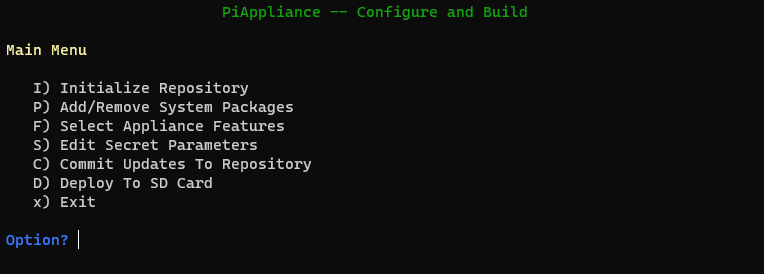

# `builder:` Configure Your Appliance
The `builder` module configures the features and requirements of your appliance.

Run it as:
```console
$ poetry run python -m builder
```



The image above reflects ALL possible options, but not each of these options are
always available.

## Initialize Repository
**Only available if there's no local repo.**

Initializes the local repository (with `git init`), and creates and adds an AWS
CodeCommit remote.

## Add/Remove System Packages
You can manipulate a list of additional software packages to install during setup of the Pi. These are installed via `apt-get`.

## Select Appliance Features
We include code and configuration to enable (optionally):
* Console Auto-login (if not running a desktop)
* Graphical appliance auto-start (if running a desktop)
* Automatic reboot of the appliance on your schedule
* CUPS print server
* VNC Server (if running a desktop)
* A Web-based User Interface which allows you to monitor, configure and control the appliance
* Automatic update of appliance code (both custom and system) upon appliance startup

## Edit Secret Parameters
Here we collect the various passwords, access keys and other secrets needed for
the appliance to operate.

We store these in `./secrets/secrets.json` which is **EXCLUDED FROM VERSION
CONTROL BY .`gitignore`**.

## Commit Updates To Repository
**Only available if you have un-managed or un-staged local changes.**

If you have local changes, use this to commit and push these changes. This will
also create a tag for the commit which will be used in future to manage
appliance updates.

## Deploy To SD Card
This will deploy what we need to bootstrap the appliance to the SD card's /boot
partition.

### How to Prepare the SD Card
1. Download and install the [Raspberry Pi Imager](https://www.raspberrypi.org/downloads/)
1. Use the Raspberry Pi Imager to write the OS image to the SD card
1. Take a coffee break while ↑ completes
1. Mount the SD card locally

### After Deploying
You'll need to unmount the SD card before putting it into your Pi.
